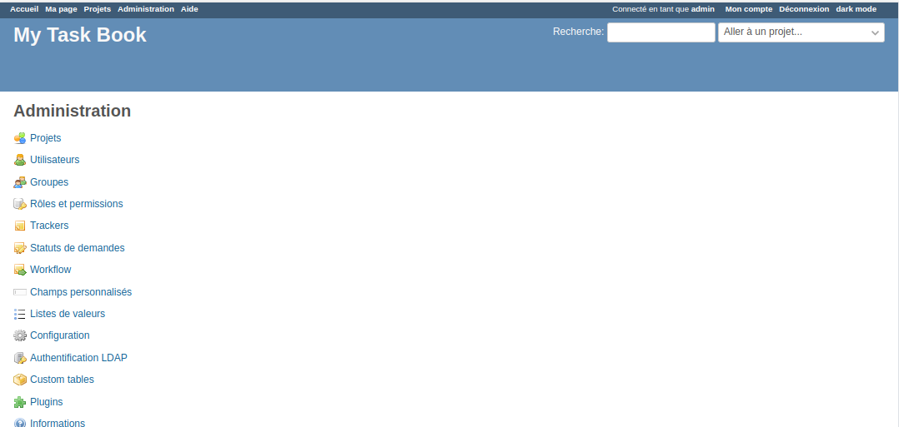
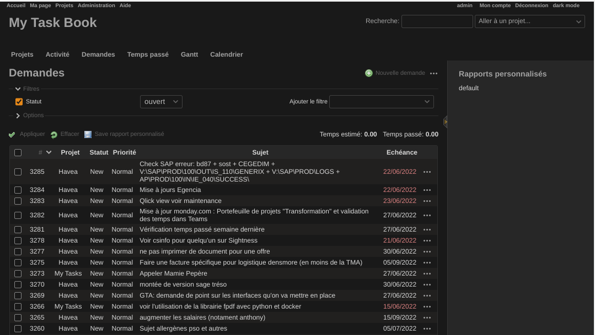
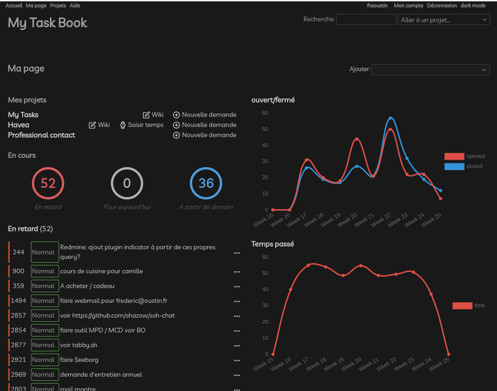

# Redmine Tags Plugin


## Plugin installation

1. Copy the plugin directory into the vendor/plugins directory
2. Restart Redmine

with a Dockerfile

```
   FROM redmine
   WORKDIR /usr/src/redmine/plugins
   RUN git clone https://github.com/fraoustin/redmine_dark.git
   WORKDIR /usr/src/redmine/
```
if you have a problem, you can test this

```
RAILS_ENV=production bundle exec rake assets:precompile
```

## Usage

you can selected dark mode with click on "dark mode" top rigth (after connect)



with default theme



with RTmaterial Theme, redmine_indicator plugin



## License

This plugin is released under the GPLv2.

## Authors

Frédéric Aoustin

Main contributors:

- Ilia Lenskii


